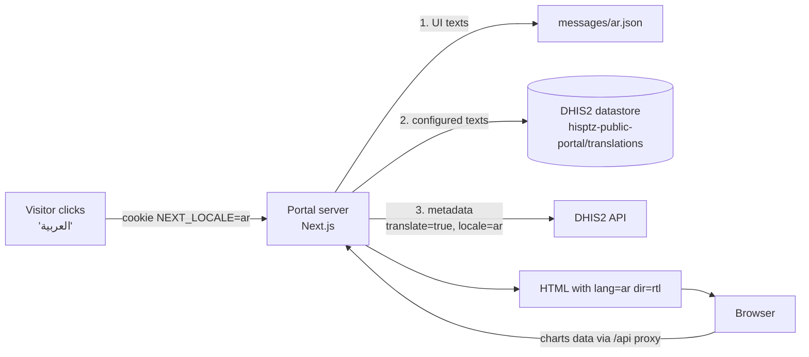

# How it works: English / Arabic support in FlexiPortal

This fork of [DHIS2 FlexiPortal](https://github.com/hisptz/dhis2-public-portal) lets portal visitors switch between
**English** and **Arabic**. In Arabic, the whole portal is displayed from right to left (RTL).

This document explains how that was built, why it was built that way, and how it was verified. It is written for
developers and implementers who maintain or deploy the fork.

---

## 1. The idea in one picture

Every text a visitor sees on the portal comes from one of **three places**. Each place needs its own way of being
translated:

| #   | Where the text comes from                               | Example                                      | How it is translated                                                                                    |
| --- | ------------------------------------------------------- | -------------------------------------------- | ------------------------------------------------------------------------------------------------------- |
| 1   | **The portal's own code**                               | "Period", "Reset filters", "Page not found"  | Translation files shipped with the portal (`messages/en.json`, `messages/ar.json`)                      |
| 2   | **The FlexiPortal Manager** (typed by an administrator) | Menu labels, module titles, captions, footer | A translations dictionary saved in the DHIS2 datastore, edited on the new Manager **Translations** page |
| 3   | **DHIS2 metadata**                                      | Chart titles, indicator names, org units     | DHIS2's own translations (Translations / Maintenance app), requested in the visitor's language          |

On top of that, the page layout must be **mirrored** for Arabic (menu on the right, text aligned right, charts
ordered from right to left).



---

## 2. Choosing the language

- The language button in the portal header saves the visitor's choice in a cookie called **`NEXT_LOCALE`**
  (valid for one year) and reloads the page.
- On every request, the server reads that cookie (`apps/portal/src/i18n/locale.ts`). Anything that is not a supported
  language (missing, `fr`, garbage…) falls back to the default language.
- The default language is English, or the value of the **`DEFAULT_LOCALE`** environment variable (`en` or `ar`).

**Why a cookie and not `/ar/...` URLs?** Adding the language to the URL would have meant changing every route, link,
redirect and the `basePath` handling of the portal, and the Manager's preview links. A cookie leaves all URLs exactly
as they were, which keeps the fork close to the original project and makes future upstream updates easier to merge.

**Why a full page reload when switching?** Some content is rendered on the server, some in the browser, and the
chart libraries cache data. A reload guarantees everything (texts, direction, cached chart data) switches together.

---

## 3. Texts of the portal itself (source 1)

- The portal uses **[next-intl](https://next-intl.dev)**, the standard translation library for the Next.js App
  Router. It works in both server components (`getTranslations`) and client components (`useTranslations`).
- All texts live in `apps/portal/messages/en.json` and `apps/portal/messages/ar.json`, grouped by area
  (`common`, `visualization`, `feedback`, `relativePeriods`, …). Every hard-coded English string of the portal was
  replaced by a message key.
- **Missing Arabic messages fall back to English** (`apps/portal/src/i18n/messages.ts`), so a forgotten key never
  shows a raw key to visitors.
- Message keys are **type-checked**: a typo in a key is a compile error (`src/i18n/next-intl.d.ts`).
- A unit test (`src/i18n/messages.test.ts`) fails if the two files do not have exactly the same keys, if a message is
  empty, or if a placeholder like `{moduleId}` is missing in the translation.

**Why not keep the `@dhis2/d2-i18n` library already used in a few places?** That library is a single global object
with one current language. The portal server renders pages for many visitors at the same time; if visitor A (Arabic)
and visitor B (English) are served at the same moment, a global language switch would make them see each other's
language. next-intl keeps the language per request, so this cannot happen. This was verified with 200 simultaneous,
mixed-language requests (see section 9).

---

## 4. Texts configured in the Manager (source 2)

### How translations are stored

Translations are a **dictionary keyed by the English text**, stored in the DHIS2 datastore, namespace
`hisptz-public-portal`, key `translations`:

```json
{
    "locales": {
        "ar": {
            "Home": "الرئيسية",
            "Malaria Surveillance": "ترصد الملاريا",
            "<p>An example address will be shown here</p>": "<p>سيظهر هنا عنوان توضيحي</p>"
        }
    }
}
```

### How the portal uses them

1. When the portal loads a configuration (appearance, menu, app metadata, a module, static items), it passes it through
   `localizeContent()` (`apps/portal/src/utils/i18n/content.ts`).
2. `localizeContent()` loads the dictionary of the visitor's language (once per request) and calls `translateConfig()`
   from the shared package (`packages/shared/src/utils/translations.ts`).
3. `translateConfig()` walks the configuration object and replaces **only** the values of display keys
   (`label`, `title`, `text`, `name`, `description`, `shortDescription`, `caption`, `content`, `copyright`,
   `staticContent`, …) that have a translation. Ids, paths, URLs, colors and layouts are never touched.
4. Anything without a translation stays in English.

Because translation happens where the configuration is loaded, every page, menu, footer and browser tab title is
translated without changing the components that display them.

### The Manager's Translations page

A new **Translations** page in the Manager (`apps/manager/src/shared/components/TranslationsPage/`):

- collects every text of the configuration with the same `translateConfig` rules, and shows where each text is used;
- lets the administrator type the Arabic text, or edit rich text in an RTL editor pre-filled with the English
  formatting;
- shows progress ("26 of 29 texts translated"), a filter for untranslated texts, search and pagination;
- saves the dictionary, and lists translations that are no longer used (for example when the English text changed).

### Why a dictionary instead of adding Arabic fields to every form?

- **No change to any configuration schema.** Existing configurations keep working as they are, the upstream Manager
  forms did not need to change, and future upstream releases are easier to merge.
- **Export/Import works automatically.** The new key is part of the configuration namespace, so it is included in the
  existing Export/Import feature.
- **Safe fallback.** A missing or broken dictionary simply means English is shown; it is validated with a schema
  before use.

The trade-off: a translation is tied to the exact English text. If the English text is edited, the Arabic version
stops applying until it is re-translated (the Manager page shows this).

---

## 5. Names coming from DHIS2 (source 3)

DHIS2 can translate its own metadata. Asking it with `translate=true&locale=ar` makes it return the Arabic names that
were entered in DHIS2 (Translations app or Maintenance app → Translate).

- **Server requests** for visualizations, maps and single values add these parameters
  (`apps/portal/src/utils/i18n/dhis2.ts`), and the chart title uses the translated `displayName`.
- **Browser requests** for chart data go through the portal's `/api` proxy. The proxy adds the parameters based on
  the visitor's cookie (`apps/portal/src/app/api/[...path]/route.ts`).
- DHIS2 translates metadata names, but **not period names or dimension names** ("September 2025", "Last 12 months",
  "Period"). For analytics responses, the proxy replaces them (`src/utils/i18n/analytics.ts`):
    - fixed periods are formatted with `@dhis2/multi-calendar-dates` in Arabic ("سبتمبر 2025", "يناير - مارس 2025"),
      keeping Western digits so they match the chart values;
    - relative periods ("آخر 12 شهرًا") and dimension names come from the portal's message files.
- The period selector and filters use the same period helpers (`src/utils/i18n/periods.ts`, `src/hooks/periods.ts`).

---

## 6. Texts inside the chart libraries

The charts, pivot tables, maps and the org-unit tree come from libraries (`@hisptz/dhis2-analytics`,
`@hisptz/dhis2-ui`) that translate their own texts ("Search name, id", "Min", "Max", "No data"…) with the global
`@dhis2/d2-i18n` object mentioned in section 3.

These libraries are only rendered in the browser, where there is a single visitor, so a global language is safe there.
The portal registers Arabic texts for them and switches their language **in the browser only**
(`apps/portal/src/i18n/library/`). On the server that global object always stays in English.

---

## 7. Right-to-left layout

| What                               | How                                                                                                                                                                                                                                            |
| ---------------------------------- | ---------------------------------------------------------------------------------------------------------------------------------------------------------------------------------------------------------------------------------------------- |
| Page direction                     | `<html lang="ar" dir="rtl">` plus Mantine's `DirectionProvider`; Mantine components mirror automatically                                                                                                                                       |
| Portal's own styles                | `left`/`right` CSS replaced by logical properties (`margin-inline-start`, `inset-inline-start`, Tailwind `end-*`, `rtl:` variant)                                                                                                              |
| Dashboard grid (react-grid-layout) | The grid library only computes positions from the left. The grid is rendered in a `dir="ltr"` container and item positions are **mirrored** (`x → columns − x − width`, `src/utils/layout.ts`); each item restores `dir="rtl"` for its content |
| Maps (Leaflet)                     | Kept `dir="ltr"` internally (Leaflet does not support RTL containers); texts are still Arabic                                                                                                                                                  |
| Untranslated content               | Rich text, captions and descriptions use `dir="auto"`, so English text that is not translated yet is still displayed left-to-right with correct punctuation                                                                                    |
| Arabic font                        | Noto Sans Arabic (SIL Open Font License) bundled with the portal (`src/fonts/`). It is limited to Arabic characters, so English text keeps the original font and the font is only downloaded when a page contains Arabic                       |
| Small screens                      | The language button shows a short label (`ع` / `EN`) on phones                                                                                                                                                                                 |

---

## 8. Security fix in the API proxy (found during the review)

The browser reads chart data through the portal's `/api` proxy, which calls DHIS2 **with the portal's Personal Access
Token**. The original project allowed a request if its URL merely _contained_ an allowed word, so
`/api/me?x=analytics` or `/api/dataStore/...?analytics` were forwarded to DHIS2 and returned data that should not be
public.

The proxy now checks the **resource itself** (first path segment: `analytics`, `legendSets`, `organisationUnits`,
`geoFeatures`, `tokens/google`) and refuses paths with `..` segments, including encoded forms like `%2e%2e`
(`apps/portal/src/utils/api/proxy.ts`, covered by unit tests).

---

## 9. How it was verified

- **Type checks, lint and formatting** pass for the portal, the Manager and the shared package.
- **1,594 unit tests** pass, including new tests for: configuration translation, message file parity, period labels,
  analytics localization, grid mirroring and the proxy whitelist.
- **Production build** of the portal, run the way the Docker image runs it (`node apps/portal/server.js`), passed an
  automated smoke test:
    - every module page in both languages returns the right `lang`/`dir` and texts;
    - missing or invalid language cookies fall back to English;
    - DHIS2 metadata, periods and org units come back translated through the proxy;
    - the proxy refuses the bypass and path-traversal attempts above;
    - **200 simultaneous mixed English/Arabic requests** never returned a page in the wrong language.
- **Manual testing in the browser** against a DHIS2 2.42 instance, in both languages and at phone width: column
  chart, pivot table, single value, grouped modules, side-by-side layouts, static pages, period and location filters,
  org-unit tree, action menus, captions, footer, mobile menu, and the complete Manager Translations workflow
  (including rich text and first-time save).

---

## 10. Where things live

| Area                             | Files                                                                                            |
| -------------------------------- | ------------------------------------------------------------------------------------------------ |
| Supported languages, cookie name | `packages/shared/src/constants/i18n.ts`                                                          |
| Content translation logic        | `packages/shared/src/utils/translations.ts`, `packages/shared/src/schemas/translations.ts`       |
| Portal UI texts                  | `apps/portal/messages/*.json`, `apps/portal/src/i18n/`                                           |
| Content, DHIS2 & period helpers  | `apps/portal/src/utils/i18n/`, `apps/portal/src/hooks/periods.ts`                                |
| API proxy                        | `apps/portal/src/app/api/[...path]/route.ts`, `apps/portal/src/utils/api/proxy.ts`               |
| Language button                  | `apps/portal/src/components/LanguageSwitcher.tsx`                                                |
| RTL grid mirroring               | `apps/portal/src/utils/layout.ts`, `FlexibleLayoutContainer.tsx`, `FlexibleLayoutItem.tsx`       |
| Arabic font                      | `apps/portal/src/fonts/`                                                                         |
| Manager Translations page        | `apps/manager/src/shared/components/TranslationsPage/`, `apps/manager/src/modules/translations/` |
| User documentation               | `apps/docs/docs/configuration/translations/index.md`                                             |

---

## 11. Setting it up

1. Deploy the portal as described in the README. Optionally set `DEFAULT_LOCALE=ar` to open the portal in Arabic.
2. Install the Manager in DHIS2.
3. Translate DHIS2 metadata used by the published visualizations (visualization names, data elements / indicators /
   program indicators, organisation units, org unit levels) in the DHIS2 Translations or Maintenance app.
4. Open **Manager → Translations** and translate the configured texts.
5. The PAT user needs the authorities from the documentation. If the portal shows program-indicator or event data, it
   also needs **View event analytics** (`F_VIEW_EVENT_ANALYTICS`).

## 12. Adding another language later

1. Add the code to `SUPPORTED_LOCALES` (and `RTL_LOCALES` if it is right-to-left) in
   `packages/shared/src/constants/i18n.ts`, with labels in `LOCALE_LABELS` / `LOCALE_SHORT_LABELS`.
2. Add `apps/portal/messages/<code>.json` (the parity test tells you which keys are missing) and register it in
   `apps/portal/src/i18n/messages.ts`.
3. Optionally add library texts in `apps/portal/src/i18n/library/`.

The Manager Translations page and the language switcher pick up the new language automatically.

## 13. Known limitations

- A content translation is tied to its English text (see section 4).
- Month names use the standard Arabic forms (يناير، فبراير…) with Western digits.
- The Manager's own screens stay in English; only the public portal is bilingual.
- Unchanged upstream behaviour worth knowing: on phones, a large header title and logo (appearance settings) can
  overflow the header; the default configuration references a portal icon document that may not exist on a new
  instance; Next.js copies `apps/portal/.env` into its standalone build output, so do not ship that file inside
  release artifacts.
